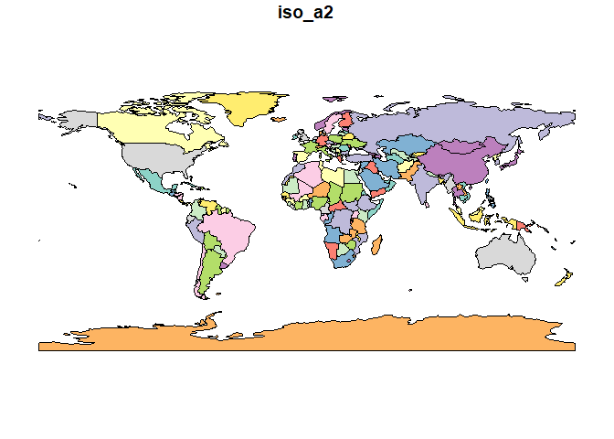
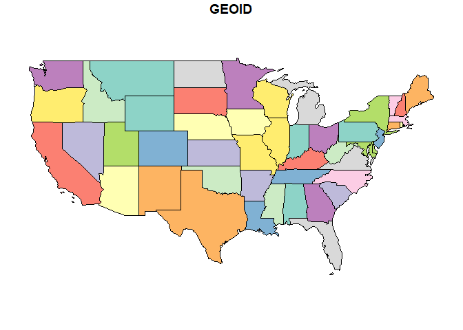
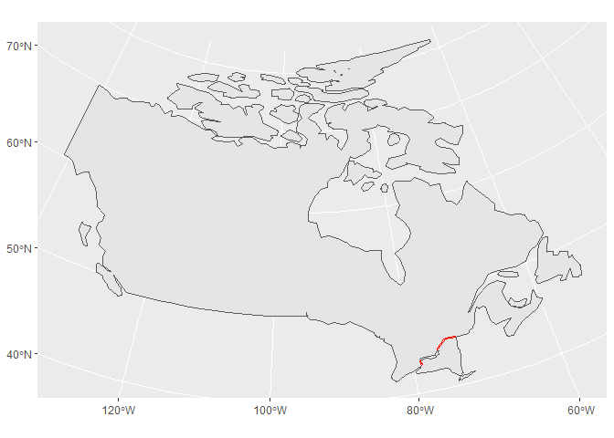
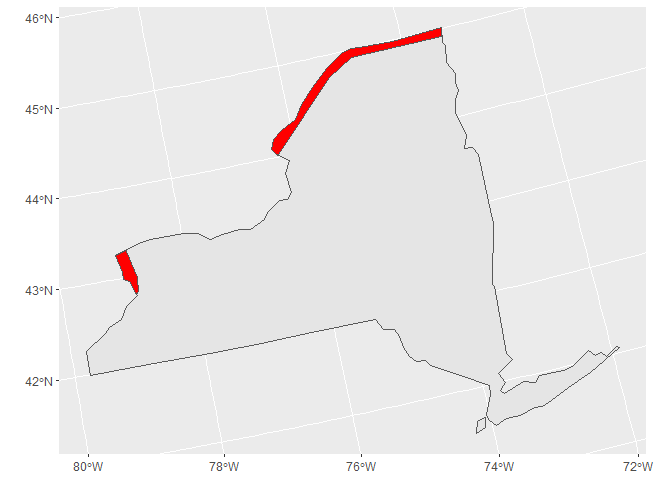

Case Study 05
================
Sadie Kratt
10/5/2021

``` r
library(spData)
```

    ## To access larger datasets in this package, install the spDataLarge
    ## package with: `install.packages('spDataLarge',
    ## repos='https://nowosad.github.io/drat/', type='source')`

``` r
library(sf)
```

    ## Linking to GEOS 3.9.1, GDAL 3.2.1, PROJ 7.2.1

``` r
library(tidyverse)
```

    ## -- Attaching packages --------------------------------------- tidyverse 1.3.1 --

    ## v ggplot2 3.3.5     v purrr   0.3.4
    ## v tibble  3.1.4     v dplyr   1.0.7
    ## v tidyr   1.1.3     v stringr 1.4.0
    ## v readr   2.0.1     v forcats 0.5.1

    ## -- Conflicts ------------------------------------------ tidyverse_conflicts() --
    ## x dplyr::filter() masks stats::filter()
    ## x dplyr::lag()    masks stats::lag()

``` r
library(ggplot2)
library(dplyr)

#load 'world' and 'states' data from spData package
data(world)
data(us_states)
world
```

    ## Simple feature collection with 177 features and 10 fields
    ## Geometry type: MULTIPOLYGON
    ## Dimension:     XY
    ## Bounding box:  xmin: -180 ymin: -89.9 xmax: 180 ymax: 83.64513
    ## Geodetic CRS:  WGS 84
    ## # A tibble: 177 x 11
    ##    iso_a2 name_long continent region_un subregion type  area_km2     pop lifeExp
    ##  * <chr>  <chr>     <chr>     <chr>     <chr>     <chr>    <dbl>   <dbl>   <dbl>
    ##  1 FJ     Fiji      Oceania   Oceania   Melanesia Sove~   1.93e4  8.86e5    70.0
    ##  2 TZ     Tanzania  Africa    Africa    Eastern ~ Sove~   9.33e5  5.22e7    64.2
    ##  3 EH     Western ~ Africa    Africa    Northern~ Inde~   9.63e4 NA         NA  
    ##  4 CA     Canada    North Am~ Americas  Northern~ Sove~   1.00e7  3.55e7    82.0
    ##  5 US     United S~ North Am~ Americas  Northern~ Coun~   9.51e6  3.19e8    78.8
    ##  6 KZ     Kazakhst~ Asia      Asia      Central ~ Sove~   2.73e6  1.73e7    71.6
    ##  7 UZ     Uzbekist~ Asia      Asia      Central ~ Sove~   4.61e5  3.08e7    71.0
    ##  8 PG     Papua Ne~ Oceania   Oceania   Melanesia Sove~   4.65e5  7.76e6    65.2
    ##  9 ID     Indonesia Asia      Asia      South-Ea~ Sove~   1.82e6  2.55e8    68.9
    ## 10 AR     Argentina South Am~ Americas  South Am~ Sove~   2.78e6  4.30e7    76.3
    ## # ... with 167 more rows, and 2 more variables: gdpPercap <dbl>,
    ## #   geom <MULTIPOLYGON [°]>

``` r
#Plot 1st column
plot(world[1])
```

<!-- -->

``` r
plot(us_states[1])
```

<!-- -->

``` r
#check CRS and
albers="+proj=aea +lat_1=29.5 +lat_2=45.5 +lat_0=37.5 +lon_0=-96 +x_0=0 +y_0=0 +ellps=GRS80 +datum=NAD83 +units=m +no_defs"
st_crs(world)
```

    ## Coordinate Reference System:
    ##   User input: EPSG:4326 
    ##   wkt:
    ## GEOGCRS["WGS 84",
    ##     DATUM["World Geodetic System 1984",
    ##         ELLIPSOID["WGS 84",6378137,298.257223563,
    ##             LENGTHUNIT["metre",1]]],
    ##     PRIMEM["Greenwich",0,
    ##         ANGLEUNIT["degree",0.0174532925199433]],
    ##     CS[ellipsoidal,2],
    ##         AXIS["geodetic latitude (Lat)",north,
    ##             ORDER[1],
    ##             ANGLEUNIT["degree",0.0174532925199433]],
    ##         AXIS["geodetic longitude (Lon)",east,
    ##             ORDER[2],
    ##             ANGLEUNIT["degree",0.0174532925199433]],
    ##     USAGE[
    ##         SCOPE["Horizontal component of 3D system."],
    ##         AREA["World."],
    ##         BBOX[-90,-180,90,180]],
    ##     ID["EPSG",4326]]

``` r
#Change the projection and create the buffer distance

canada_buffer <-  world %>% 
 st_transform(crs = "+proj=aea +lat_1=29.5 +lat_2=45.5 +lat_0=37.5 +lon_0=-96 +x_0=0 +y_0=0 +ellps=GRS80 +datum=NAD83 +units=m +no_defs") %>% 
 filter(name_long == "Canada") %>% 
 st_buffer(dist = 10000)

#Change the projection of the NY object
ny <-  us_states %>% 
 st_transform(crs = "+proj=aea +lat_1=29.5 +lat_2=45.5 +lat_0=37.5 +lon_0=-96 +x_0=0 +y_0=0 +ellps=GRS80 +datum=NAD83 +units=m +no_defs") %>% 
 filter(NAME == "New York")

#Intersect the border of NY and Canada
intersection <- st_intersection(canada_buffer, ny)
```

    ## Warning: attribute variables are assumed to be spatially constant throughout all
    ## geometries

``` r
#Plot them
ggplot() +
 geom_sf(data = ny) +
 geom_sf(data= canada_buffer) +
 geom_sf(data = intersection, color="red")
```

<!-- -->

``` r
#Zoomed in without Canada
ggplot() +
 geom_sf(data = ny) +
 geom_sf(data = intersection, fill="red")
```

<!-- -->

``` r
#Calculate the area in km^2 of the intersection polygon
library(units)
```

    ## udunits database from C:/Users/sadie/Documents/R/win-library/4.1/units/share/udunits/udunits2.xml

``` r
intersection %>% 
 st_area() %>%
 set_units(km^2)
```

    ## 3495.19 [km^2]
