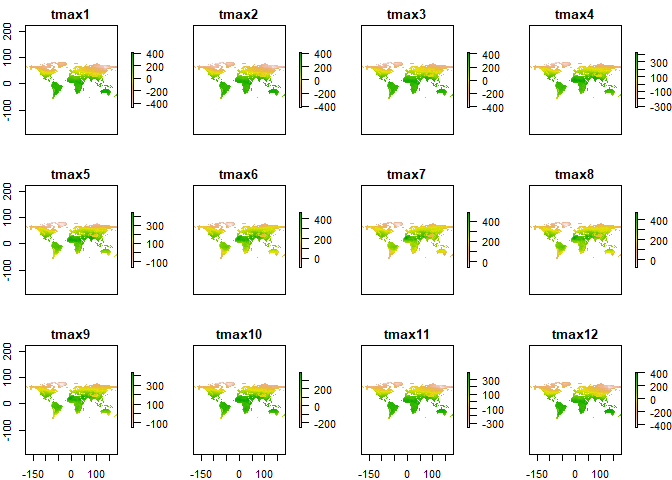
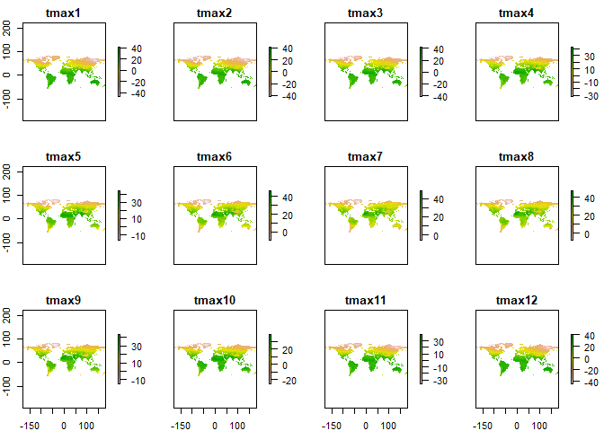
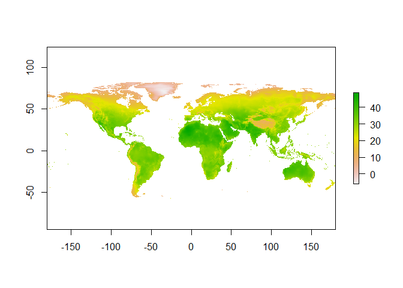
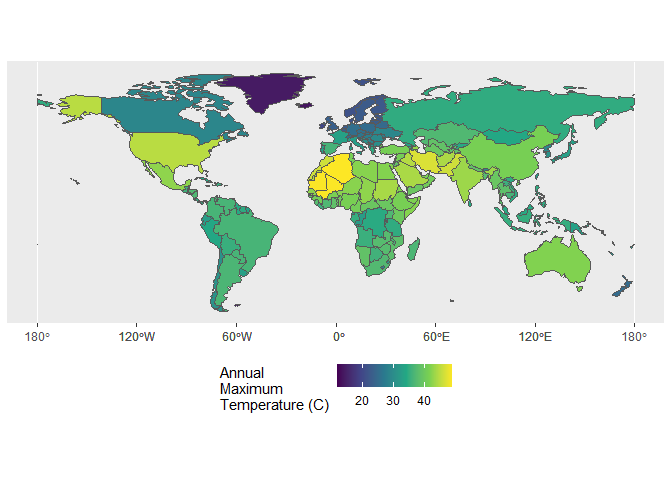

Case Study 06
================
Your Name
August 1, 2020

``` r
library(raster)
```

    ## Loading required package: sp

``` r
library(sp)
library(spData)
```

    ## To access larger datasets in this package, install the spDataLarge
    ## package with: `install.packages('spDataLarge',
    ## repos='https://nowosad.github.io/drat/', type='source')`

``` r
library(tidyverse)
```

    ## -- Attaching packages --------------------------------------- tidyverse 1.3.1 --

    ## v ggplot2 3.3.5     v purrr   0.3.4
    ## v tibble  3.1.4     v dplyr   1.0.7
    ## v tidyr   1.1.3     v stringr 1.4.0
    ## v readr   2.0.1     v forcats 0.5.1

    ## -- Conflicts ------------------------------------------ tidyverse_conflicts() --
    ## x tidyr::extract() masks raster::extract()
    ## x dplyr::filter()  masks stats::filter()
    ## x dplyr::lag()     masks stats::lag()
    ## x dplyr::select()  masks raster::select()

``` r
library(sf)
```

    ## Linking to GEOS 3.9.1, GDAL 3.2.1, PROJ 7.2.1

``` r
#load 'world' data from spData package
data(world)
tmax_monthly <- getData(name = "worldclim",
                        var="tmax", res=10)
world$subregion
```

    ##   [1] "Melanesia"                 "Eastern Africa"           
    ##   [3] "Northern Africa"           "Northern America"         
    ##   [5] "Northern America"          "Central Asia"             
    ##   [7] "Central Asia"              "Melanesia"                
    ##   [9] "South-Eastern Asia"        "South America"            
    ##  [11] "South America"             "Middle Africa"            
    ##  [13] "Eastern Africa"            "Eastern Africa"           
    ##  [15] "Northern Africa"           "Middle Africa"            
    ##  [17] "Caribbean"                 "Caribbean"                
    ##  [19] "Eastern Europe"            "Caribbean"                
    ##  [21] "South America"             "Northern Europe"          
    ##  [23] "Northern America"          "Seven seas (open ocean)"  
    ##  [25] "South-Eastern Asia"        "Southern Africa"          
    ##  [27] "Southern Africa"           "Central America"          
    ##  [29] "South America"             "South America"            
    ##  [31] "South America"             "South America"            
    ##  [33] "South America"             "Central America"          
    ##  [35] "Central America"           "Central America"          
    ##  [37] "Central America"           "Central America"          
    ##  [39] "Central America"           "Central America"          
    ##  [41] "South America"             "South America"            
    ##  [43] "South America"             "Western Europe"           
    ##  [45] "South America"             "Caribbean"                
    ##  [47] "Caribbean"                 "Caribbean"                
    ##  [49] "Eastern Africa"            "Southern Africa"          
    ##  [51] "Southern Africa"           "Western Africa"           
    ##  [53] "Western Africa"            "Western Africa"           
    ##  [55] "Western Africa"            "Western Africa"           
    ##  [57] "Western Africa"            "Middle Africa"            
    ##  [59] "Western Africa"            "Western Africa"           
    ##  [61] "Western Africa"            "Western Africa"           
    ##  [63] "Western Africa"            "Western Africa"           
    ##  [65] "Western Africa"            "Western Africa"           
    ##  [67] "Middle Africa"             "Middle Africa"            
    ##  [69] "Middle Africa"             "Middle Africa"            
    ##  [71] "Eastern Africa"            "Eastern Africa"           
    ##  [73] "Eastern Africa"            "Southern Africa"          
    ##  [75] "Middle Africa"             "Eastern Africa"           
    ##  [77] "Western Asia"              "Western Asia"             
    ##  [79] "Eastern Africa"            "Western Asia"             
    ##  [81] "Western Africa"            "Northern Africa"          
    ##  [83] "Northern Africa"           "Western Asia"             
    ##  [85] "Western Asia"              "Western Asia"             
    ##  [87] "Western Asia"              "Western Asia"             
    ##  [89] "Western Asia"              "Melanesia"                
    ##  [91] "South-Eastern Asia"        "South-Eastern Asia"       
    ##  [93] "South-Eastern Asia"        "South-Eastern Asia"       
    ##  [95] "South-Eastern Asia"        "Eastern Asia"             
    ##  [97] "Eastern Asia"              "Eastern Asia"             
    ##  [99] "Southern Asia"             "Southern Asia"            
    ## [101] "Southern Asia"             "Southern Asia"            
    ## [103] "Southern Asia"             "Southern Asia"            
    ## [105] "Central Asia"              "Central Asia"             
    ## [107] "Central Asia"              "Southern Asia"            
    ## [109] "Western Asia"              "Western Asia"             
    ## [111] "Northern Europe"           "Eastern Europe"           
    ## [113] "Eastern Europe"            "Eastern Europe"           
    ## [115] "Western Europe"            "Eastern Europe"           
    ## [117] "Eastern Europe"            "Eastern Europe"           
    ## [119] "Northern Europe"           "Northern Europe"          
    ## [121] "Northern Europe"           "Western Europe"           
    ## [123] "Eastern Europe"            "Southern Europe"          
    ## [125] "Western Asia"              "Southern Europe"          
    ## [127] "Southern Europe"           "Western Europe"           
    ## [129] "Western Europe"            "Western Europe"           
    ## [131] "Western Europe"            "Southern Europe"          
    ## [133] "Southern Europe"           "Northern Europe"          
    ## [135] "Melanesia"                 "Melanesia"                
    ## [137] "Australia and New Zealand" "Australia and New Zealand"
    ## [139] "Southern Asia"             "Eastern Asia"             
    ## [141] "Eastern Asia"              "Southern Europe"          
    ## [143] "Northern Europe"           "Northern Europe"          
    ## [145] "Northern Europe"           "Western Asia"             
    ## [147] "Western Asia"              "South-Eastern Asia"       
    ## [149] "South-Eastern Asia"        "South-Eastern Asia"       
    ## [151] "Southern Europe"           "Northern Europe"          
    ## [153] "Eastern Europe"            "Eastern Europe"           
    ## [155] "Eastern Africa"            "Eastern Asia"             
    ## [157] "South America"             "Western Asia"             
    ## [159] "Western Asia"              "Antarctica"               
    ## [161] "Western Asia"              "Western Asia"             
    ## [163] "Northern Africa"           "Northern Africa"          
    ## [165] "Northern Africa"           "Eastern Africa"           
    ## [167] "Eastern Africa"            "Eastern Africa"           
    ## [169] "Eastern Africa"            "Eastern Africa"           
    ## [171] "Southern Europe"           "Southern Europe"          
    ## [173] "Southern Europe"           "Southern Europe"          
    ## [175] "Southern Europe"           "Caribbean"                
    ## [177] "Eastern Africa"

``` r
world <- filter(world, subregion!= "Antarctica")
#Convert to sp object from sf
as(world, "Spatial")
```

    ## class       : SpatialPolygonsDataFrame 
    ## features    : 176 
    ## extent      : -180, 180, -55.61183, 83.64513  (xmin, xmax, ymin, ymax)
    ## crs         : +proj=longlat +datum=WGS84 +no_defs 
    ## variables   : 10
    ## names       : iso_a2,   name_long,     continent,               region_un,                 subregion,              type,         area_km2,        pop,          lifeExp,        gdpPercap 
    ## min values  :     AE, Afghanistan,        Africa,                  Africa, Australia and New Zealand,           Country, 2416.87048266498,      56295,           50.621, 597.135168986395 
    ## max values  :     ZW,    Zimbabwe, South America, Seven seas (open ocean),            Western Europe, Sovereign country, 17018507.4094666, 1364270000, 83.5878048780488,  120860.06755829

``` r
tmax_monthly
```

    ## class      : RasterStack 
    ## dimensions : 900, 2160, 1944000, 12  (nrow, ncol, ncell, nlayers)
    ## resolution : 0.1666667, 0.1666667  (x, y)
    ## extent     : -180, 180, -60, 90  (xmin, xmax, ymin, ymax)
    ## crs        : +proj=longlat +datum=WGS84 
    ## names      : tmax1, tmax2, tmax3, tmax4, tmax5, tmax6, tmax7, tmax8, tmax9, tmax10, tmax11, tmax12

``` r
plot(tmax_monthly)
```

<!-- -->

``` r
#Convert to celsius
gain(tmax_monthly) <- 0.1
plot(tmax_monthly)
```

<!-- -->

``` r
tmax_annual <- max(tmax_monthly)
plot(tmax_annual)
```

<!-- -->

``` r
#Change the name of the layer to "tmax"
names(tmax_annual) <- "tmax"

#Calculate the max temperature observed in each country
max_temp_country <- raster::extract(tmax_annual, world, fun=max, na.rm=T, small=T, sp=T)
#Convert object to sf
max_temp_country <- st_as_sf(max_temp_country)

#Make a map
ggplot(max_temp_country) +
  geom_sf(aes(fill=tmax)) +
  scale_fill_viridis_c(name="Annual\nMaximum\nTemperature (C)") +
  theme(legend.position = 'bottom')
```

<!-- -->

``` r
#Create a summary table
hottest_country <- max_temp_country%>%
  group_by(continent)%>%
  top_n(tmax, n=1)%>%
  select(name_long, continent, tmax)%>%
  arrange(desc(tmax))%>%
  st_set_geometry(NULL)
hottest_country
```

    ## # A tibble: 7 x 3
    ## # Groups:   continent [7]
    ##   name_long                           continent                tmax
    ## * <chr>                               <chr>                   <dbl>
    ## 1 Algeria                             Africa                   48.9
    ## 2 Iran                                Asia                     46.7
    ## 3 United States                       North America            44.8
    ## 4 Australia                           Oceania                  41.8
    ## 5 Argentina                           South America            36.5
    ## 6 Spain                               Europe                   36.1
    ## 7 French Southern and Antarctic Lands Seven seas (open ocean)  11.8
