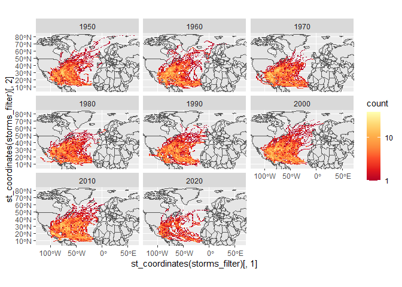

Case Study 09
================
Sadie Kratt
November 2, 2021

``` r
library(sf)
```

    ## Linking to GEOS 3.9.1, GDAL 3.2.1, PROJ 7.2.1

``` r
library(tidyverse)
```

    ## -- Attaching packages --------------------------------------- tidyverse 1.3.1 --

    ## v ggplot2 3.3.5     v purrr   0.3.4
    ## v tibble  3.1.4     v dplyr   1.0.7
    ## v tidyr   1.1.3     v stringr 1.4.0
    ## v readr   2.0.1     v forcats 0.5.1

    ## -- Conflicts ------------------------------------------ tidyverse_conflicts() --
    ## x dplyr::filter() masks stats::filter()
    ## x dplyr::lag()    masks stats::lag()

``` r
library(ggmap)
```

    ## Google's Terms of Service: https://cloud.google.com/maps-platform/terms/.

    ## Please cite ggmap if you use it! See citation("ggmap") for details.

``` r
library(rnoaa)
```

    ## Registered S3 method overwritten by 'hoardr':
    ##   method           from
    ##   print.cache_info httr

``` r
library(spData)
```

    ## To access larger datasets in this package, install the spDataLarge
    ## package with: `install.packages('spDataLarge',
    ## repos='https://nowosad.github.io/drat/', type='source')`

``` r
data(world)
data(us_states)
```

``` r
# Download zipped data from noaa with storm track information
dataurl="https://www.ncei.noaa.gov/data/international-best-track-archive-for-climate-stewardship-ibtracs/v04r00/access/shapefile/IBTrACS.NA.list.v04r00.points.zip"
tdir=tempdir()
download.file(dataurl,destfile=file.path(tdir,"temp.zip"))
unzip(file.path(tdir,"temp.zip"),exdir = tdir)
list.files(tdir)
```

    ## [1] "file390023265ab3"                  "file390056be77fd"                 
    ## [3] "IBTrACS.NA.list.v04r00.points.dbf" "IBTrACS.NA.list.v04r00.points.prj"
    ## [5] "IBTrACS.NA.list.v04r00.points.shp" "IBTrACS.NA.list.v04r00.points.shx"
    ## [7] "temp.zip"

``` r
storm_data <- read_sf(list.files(tdir,pattern=".shp",full.names = T))
```

``` r
#Filter the storms from 1950 to the present
storms_filter <- storm_data %>% 
  filter(year >= 1950) %>% 
  mutate_if(is.numeric, function(x) ifelse(x == -999.0, NA, x)) %>% 
  mutate(decade = (floor(year/10)*10)) 
#Find the bounding box of the data
region <- st_bbox(storms_filter)
```

``` r
#Make plot
ggplot()+
  geom_sf(data=world, inherit.aes=F)+
  facet_wrap(~decade)+
  stat_bin2d(data=storms_filter, aes(y=st_coordinates(storms_filter)[,2], x=st_coordinates(storms_filter)[,1]),bins=100)+
  scale_fill_distiller(palette="YlOrRd", trans="log", direction=-1, breaks = c(1,10,100,1000))+
  coord_sf(ylim=region[c(2,4)], xlim=region[c(1,3)])
```

<!-- -->

``` r
#Calculate table of the five states with most storms
us_states<- st_transform(us_states, st_crs(storms_filter))

#Rename the NAME column
states<- us_states %>% 
  select(state=NAME)

#Join the data
storm_states <- st_join(storms_filter, states, join = st_intersects,left = F) %>%
  group_by(state) %>%
  summarize(storms_filter=length(unique(NAME))) %>%
  arrange(desc(storms_filter)) %>%
  slice(1:5)

#view table
storm_states
```

    ## Simple feature collection with 5 features and 2 fields
    ## Geometry type: MULTIPOINT
    ## Dimension:     XY
    ## Bounding box:  xmin: -106.37 ymin: 24.6 xmax: -75.9 ymax: 36.55
    ## Geodetic CRS:  WGS 84
    ## # A tibble: 5 x 3
    ##   state          storms_filter                                          geometry
    ##   <chr>                  <int>                                  <MULTIPOINT [°]>
    ## 1 Florida                   84 ((-86.94 30.95), (-87.21 30.92), (-87.44 30.89),~
    ## 2 North Carolina            64 ((-81.67 36.55), (-82 35.8), (-81.7 35.9), (-81.~
    ## 3 Georgia                   60 ((-83.12 34.34), (-83.5 34.5), (-83.28 34.65), (~
    ## 4 Texas                     54 ((-94.09 33.48), (-94.9 33.5), (-94.56 33.36), (~
    ## 5 Louisiana                 52 ((-90.6 29.4), (-90.5 29.4), (-90.3 29.3), (-90.~
