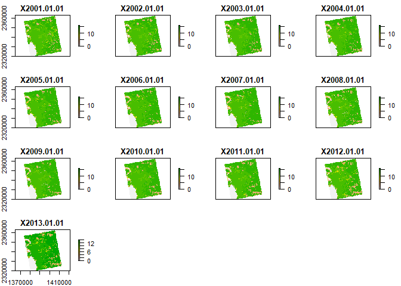
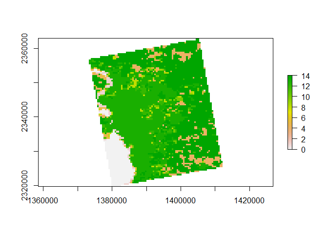
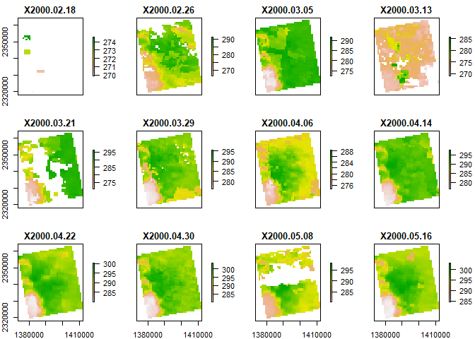
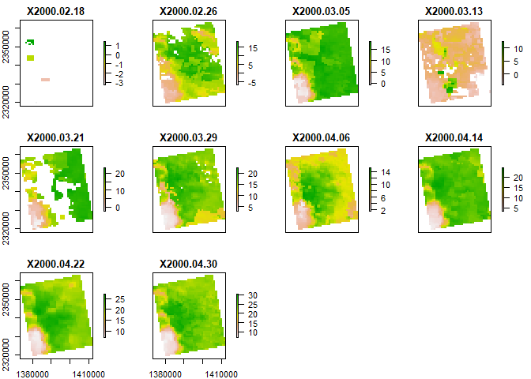
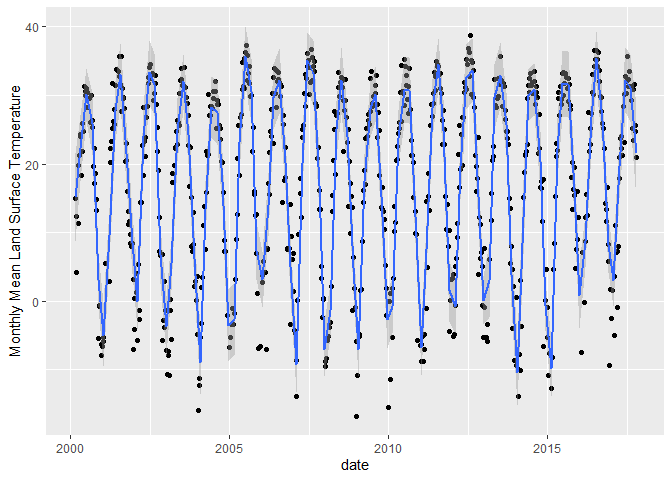
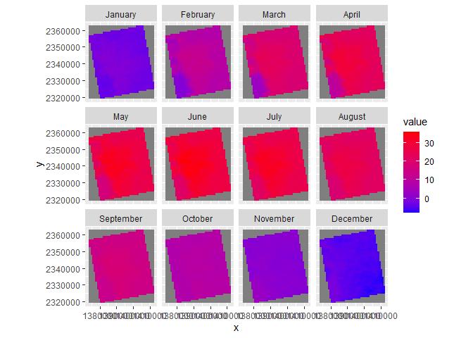

Case Study 10
================
Sadie Kratt
November 9, 2021

``` r
#Load needed packages
library(raster)
```

    ## Loading required package: sp

``` r
library(rasterVis)
```

    ## Loading required package: lattice

``` r
library(rgdal)
```

    ## Please note that rgdal will be retired by the end of 2023,
    ## plan transition to sf/stars/terra functions using GDAL and PROJ
    ## at your earliest convenience.
    ## 
    ## rgdal: version: 1.5-27, (SVN revision 1148)
    ## Geospatial Data Abstraction Library extensions to R successfully loaded
    ## Loaded GDAL runtime: GDAL 3.2.1, released 2020/12/29
    ## Path to GDAL shared files: C:/Users/sadie/Documents/R/win-library/4.1/rgdal/gdal
    ## GDAL binary built with GEOS: TRUE 
    ## Loaded PROJ runtime: Rel. 7.2.1, January 1st, 2021, [PJ_VERSION: 721]
    ## Path to PROJ shared files: C:/Users/sadie/Documents/R/win-library/4.1/rgdal/proj
    ## PROJ CDN enabled: FALSE
    ## Linking to sp version:1.4-5
    ## To mute warnings of possible GDAL/OSR exportToProj4() degradation,
    ## use options("rgdal_show_exportToProj4_warnings"="none") before loading sp or rgdal.
    ## Overwritten PROJ_LIB was C:/Users/sadie/Documents/R/win-library/4.1/rgdal/proj

``` r
library(ggmap)
```

    ## Loading required package: ggplot2

    ## Google's Terms of Service: https://cloud.google.com/maps-platform/terms/.

    ## Please cite ggmap if you use it! See citation("ggmap") for details.

``` r
library(tidyverse)
```

    ## -- Attaching packages --------------------------------------- tidyverse 1.3.1 --

    ## v tibble  3.1.4     v dplyr   1.0.7
    ## v tidyr   1.1.3     v stringr 1.4.0
    ## v readr   2.0.1     v forcats 0.5.1
    ## v purrr   0.3.4

    ## -- Conflicts ------------------------------------------ tidyverse_conflicts() --
    ## x tidyr::extract() masks raster::extract()
    ## x dplyr::filter()  masks stats::filter()
    ## x dplyr::lag()     masks stats::lag()
    ## x dplyr::select()  masks raster::select()

``` r
library(knitr)

# New Packages
library(ncdf4) # to import data from netcdf format
```

``` r
#Land Use Cover
# Create afolder to hold the downloaded data
dir.create("data",showWarnings = F) #create a folder to hold the data

lulc_url="https://github.com/adammwilson/DataScienceData/blob/master/inst/extdata/appeears/MCD12Q1.051_aid0001.nc?raw=true"
lst_url="https://github.com/adammwilson/DataScienceData/blob/master/inst/extdata/appeears/MOD11A2.006_aid0001.nc?raw=true"

# download them
download.file(lulc_url,destfile="data/MCD12Q1.051_aid0001.nc", mode="wb")
download.file(lst_url,destfile="data/MOD11A2.006_aid0001.nc", mode="wb")

#Load data into R
lulc=stack("data/MCD12Q1.051_aid0001.nc",varname="Land_Cover_Type_1")
```

    ## [1] ">>>> WARNING <<<  attribute latitude_of_projection_origin is an 8-byte value, but R"
    ## [1] "does not support this data type. I am returning a double precision"
    ## [1] "floating point, but you must be aware that this could lose precision!"
    ## [1] ">>>> WARNING <<<  attribute longitude_of_central_meridian is an 8-byte value, but R"
    ## [1] "does not support this data type. I am returning a double precision"
    ## [1] "floating point, but you must be aware that this could lose precision!"
    ## [1] ">>>> WARNING <<<  attribute longitude_of_projection_origin is an 8-byte value, but R"
    ## [1] "does not support this data type. I am returning a double precision"
    ## [1] "floating point, but you must be aware that this could lose precision!"
    ## [1] ">>>> WARNING <<<  attribute straight_vertical_longitude_from_pole is an 8-byte value, but R"
    ## [1] "does not support this data type. I am returning a double precision"
    ## [1] "floating point, but you must be aware that this could lose precision!"
    ## [1] ">>>> WARNING <<<  attribute false_easting is an 8-byte value, but R"
    ## [1] "does not support this data type. I am returning a double precision"
    ## [1] "floating point, but you must be aware that this could lose precision!"
    ## [1] ">>>> WARNING <<<  attribute false_northing is an 8-byte value, but R"
    ## [1] "does not support this data type. I am returning a double precision"
    ## [1] "floating point, but you must be aware that this could lose precision!"

    ## Warning in .getCRSfromGridMap4(atts): cannot process these parts of the CRS:
    ## _CoordinateAxisTypes=GeoX GeoY
    ## horizontal_datum_name=WGS84

    ## Warning in .doTime(r, nc, zvar, dim3): assuming a standard calender:julian

    ## Warning in .doTime(st, nc, zvar, dim3): assuming a standard calender:julian

``` r
lst=stack("data/MOD11A2.006_aid0001.nc",varname="LST_Day_1km")
```

    ## [1] ">>>> WARNING <<<  attribute latitude_of_projection_origin is an 8-byte value, but R"
    ## [1] "does not support this data type. I am returning a double precision"
    ## [1] "floating point, but you must be aware that this could lose precision!"
    ## [1] ">>>> WARNING <<<  attribute longitude_of_central_meridian is an 8-byte value, but R"
    ## [1] "does not support this data type. I am returning a double precision"
    ## [1] "floating point, but you must be aware that this could lose precision!"
    ## [1] ">>>> WARNING <<<  attribute longitude_of_projection_origin is an 8-byte value, but R"
    ## [1] "does not support this data type. I am returning a double precision"
    ## [1] "floating point, but you must be aware that this could lose precision!"
    ## [1] ">>>> WARNING <<<  attribute straight_vertical_longitude_from_pole is an 8-byte value, but R"
    ## [1] "does not support this data type. I am returning a double precision"
    ## [1] "floating point, but you must be aware that this could lose precision!"
    ## [1] ">>>> WARNING <<<  attribute false_easting is an 8-byte value, but R"
    ## [1] "does not support this data type. I am returning a double precision"
    ## [1] "floating point, but you must be aware that this could lose precision!"
    ## [1] ">>>> WARNING <<<  attribute false_northing is an 8-byte value, but R"
    ## [1] "does not support this data type. I am returning a double precision"
    ## [1] "floating point, but you must be aware that this could lose precision!"

    ## Warning in .getCRSfromGridMap4(atts): cannot process these parts of the CRS:
    ## _CoordinateAxisTypes=GeoX GeoY
    ## horizontal_datum_name=WGS84

    ## Warning in .doTime(r, nc, zvar, dim3): assuming a standard calender:julian

    ## Warning in .doTime(st, nc, zvar, dim3): assuming a standard calender:julian

``` r
#Explore the dataset
plot(lulc)
```

<!-- -->

``` r
#Choose one
lulc=lulc[[13]]
plot(lulc)
```

<!-- -->

``` r
#Process landcover data
Land_Cover_Type_1 = c(
    Water = 0, 
    `Evergreen Needleleaf forest` = 1, 
    `Evergreen Broadleaf forest` = 2,
    `Deciduous Needleleaf forest` = 3, 
    `Deciduous Broadleaf forest` = 4,
    `Mixed forest` = 5, 
    `Closed shrublands` = 6,
    `Open shrublands` = 7,
    `Woody savannas` = 8, 
    Savannas = 9,
    Grasslands = 10,
    `Permanent wetlands` = 11, 
    Croplands = 12,
    `Urban & built-up` = 13,
    `Cropland/Natural vegetation mosaic` = 14, 
    `Snow & ice` = 15,
    `Barren/Sparsely vegetated` = 16, 
    Unclassified = 254,
    NoDataFill = 255)

lcd=data.frame(
  ID=Land_Cover_Type_1,
  landcover=names(Land_Cover_Type_1),
  col=c("#000080","#008000","#00FF00", "#99CC00","#99FF99", "#339966", "#993366", "#FFCC99", "#CCFFCC", "#FFCC00", "#FF9900", "#006699", "#FFFF00", "#FF0000", "#999966", "#FFFFFF", "#808080", "#000000", "#000000"),
  stringsAsFactors = F)
# colors from https://lpdaac.usgs.gov/about/news_archive/modisterra_land_cover_types_yearly_l3_global_005deg_cmg_mod12c1
kable(head(lcd))
```

|                             |  ID | landcover                   | col     |
|:----------------------------|----:|:----------------------------|:--------|
| Water                       |   0 | Water                       | #000080 |
| Evergreen Needleleaf forest |   1 | Evergreen Needleleaf forest | #008000 |
| Evergreen Broadleaf forest  |   2 | Evergreen Broadleaf forest  | #00FF00 |
| Deciduous Needleleaf forest |   3 | Deciduous Needleleaf forest | #99CC00 |
| Deciduous Broadleaf forest  |   4 | Deciduous Broadleaf forest  | #99FF99 |
| Mixed forest                |   5 | Mixed forest                | #339966 |

``` r
# convert to raster (easy)
lulc=as.factor(lulc)

# update the RAT with a left join
levels(lulc)=left_join(levels(lulc)[[1]],lcd)
```

    ## Joining, by = "ID"

``` r
# plot it
gplot(lulc)+
  geom_raster(aes(fill=as.factor(value)))+
  scale_fill_manual(values=levels(lulc)[[1]]$col,
                    labels=levels(lulc)[[1]]$landcover,
                    name="Landcover Type")+
  coord_equal()+
  theme(legend.position = "bottom")+
  guides(fill=guide_legend(ncol=1,byrow=TRUE))
```

<!-- -->

``` r
#Land Surface Temperature
plot(lst[[1:12]])
```

<!-- -->

``` r
#convert degrees K to degrees C
offs(lst)=-273.15
plot(lst[[1:10]])
```

<!-- -->

``` r
#add dates
names(lst)[1:5]
```

    ## [1] "X2000.02.18" "X2000.02.26" "X2000.03.05" "X2000.03.13" "X2000.03.21"

``` r
#Convert values to r format
tdates=names(lst)%>%
  sub(pattern="X",replacement="")%>%
  as.Date("%Y.%m.%d")

names(lst)=1:nlayers(lst)
lst=setZ(lst,tdates)
```

``` r
#Part 1: Extract timeseries for a point
#Define projection for point
lw=SpatialPoints(data.frame(x= -78.791547,y=43.007211))

#Set spatial projection
projection(lw) <- "+proj=longlat"

#Transform point to projection
lw_projected <- spTransform(x=lw, CRS("+proj=longlat"))

#Extract the LST data for that location
lst_new <-raster::extract(lst,lw,buffer=1000,fun=mean,na.rm=T)%>%
  t()%>%
#Make data frame of dates
as.data.frame()%>%
mutate(date=getZ(lst))
```

    ## Warning in .local(x, y, ...): Transforming SpatialPoints to the CRS of the
    ## Raster

``` r
#Plot it
ggplot(lst_new, aes(x=date, y=V1)) +
  geom_point() +
  geom_smooth(span= .01, n=100) +
  labs(y="Monthly Mean Land Surface Temperature")
```

    ## `geom_smooth()` using method = 'loess' and formula 'y ~ x'

    ## Warning: Removed 82 rows containing non-finite values (stat_smooth).

    ## Warning in simpleLoess(y, x, w, span, degree = degree, parametric =
    ## parametric, : k-d tree limited by memory. ncmax= 729

    ## Warning in predLoess(object$y, object$x, newx = if
    ## (is.null(newdata)) object$x else if (is.data.frame(newdata))
    ## as.matrix(model.frame(delete.response(terms(object)), : k-d tree limited by
    ## memory. ncmax= 729

    ## Warning: Removed 82 rows containing missing values (geom_point).

<!-- -->

``` r
#Part 2: Summarize Weekly data to monthly climatologies
#Make variable called tmonth
tmonth <- as.numeric(format(getZ(lst),"%m"))
#Summarize mean value per month
lst_month <- stackApply(lst,tmonth,fun=mean)
names(lst_month)=month.name
```

``` r
#Plot map for each month using RasterVis' gplot
gplot(lst_month) +
  geom_raster(aes(fill=value)) + 
  facet_wrap(~variable) + 
  coord_equal()+ 
  theme(legend.position="right") +
  scale_fill_gradient(low = "#0000FF", high = "#FF0000")
```

<!-- -->

``` r
#calculate monthly mean
monthly_mean <- cellStats(lst_month,mean)
#print monthly mean
monthly_mean
```

    ##   January  February     March     April       May      June      July    August 
    ## -2.127507  8.710271 18.172077 23.173591 26.990005 28.840144 27.358260 22.927727 
    ## September   October  November  December 
    ## 15.477510  8.329881  0.586179 -4.754134
